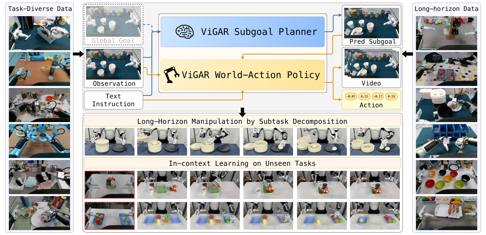

<div align="center">

# Rethinking World-Action Model for Compositional and In-Context Robotic Manipulation

ViGAR: **Vi**sual **G**oal-conditioned **A**ction **R**easoning

Shukai Gong<sup>1*</sup> · Xuanran Zhai<sup>2*</sup> · Yintianrun Zhang<sup>1*</sup> · Ruopeng Cui<sup>2</sup> · Ye Huang<sup>1</sup> · Yiyang Fu<sup>1</sup> · Dexuan Lyu<sup>2</sup><br>
Chaojie Li<sup>2</sup> · Xinyi Song<sup>2</sup> · Peiwen Lin<sup>2</sup> · Chuang Wang<sup>2</sup> · Mingyuan Jia<sup>3</sup> · Yufan Deng<sup>1</sup><br>
Jiaxin Fang<sup>3</sup> · Bo Liang<sup>1</sup> · Jiaxin Li<sup>1</sup> · Yuxiang Gao<sup>3†</sup> · Hao Liu<sup>2†</sup> · Daquan Zhou<sup>1†</sup>

<sup>1</sup> Peking University &nbsp; <sup>2</sup> AgiBot &nbsp; <sup>3</sup> CocoMatrix

<sup>*</sup> Equal contribution &nbsp; <sup>†</sup> Corresponding author

[](https://dagroup-pku.github.io/ViGAR/)
[](https://arxiv.org/abs/2610.02368)
[](https://huggingface.co/papers/2610.02368)
[](https://huggingface.co/DAGroup-PKU/ViGAR)
[](docs/installation.md)
[](docs/installation.md)
[](LICENSE)

</div>



## 📑 Todo List

- [x] Evaluation code and checkpoints on **RoboTwin**.
- [x] Training code and data on **RoboTwin**.
- [ ] 900-hour real-robot dataset with subtask annotations.

## 🎬 Demo

https://github.com/user-attachments/assets/deeeb726-079d-49eb-a710-f549fe473520

## ⚙️ Getting Started

```bash
git clone https://github.com/DAGroup-PKU/ViGAR.git
cd ViGAR
```

| Step | Guide |
| :--- | :--- |
| Set up the environments | [Installation](docs/installation.md) |
| Download weights and data | [Download](docs/download.md) |
| Evaluate on Simulation Benchmark | [Evaluation](docs/evaluation.md) |
| Train the policies and subgoal planners in ViGAR | [Training](docs/training.md) |

## 💪 Repository

```text
vigar/            Policy model, training and serving
subgoal_planner/  Planner runtime and training implementation
simulation/       RoboTwin tasks and simulator setup
data/             Annotation, goal generation and action conversion
evaluation/       Policy/planner services and closed-loop evaluation
scripts/          Installation and launch commands
configs/          Task and inference settings
docs/             Installation, download, evaluation and training guides
```

The policy uses VeOmni with a bundled Cosmos runtime. Planner processes select
their own Cosmos runtime through `PYTHONPATH`; they run separately from policy
and simulator processes.

## 🙏 Acknowledgements

Built on [NVIDIA Cosmos](https://github.com/NVIDIA/cosmos),
[VeOmni](https://github.com/ByteDance-Seed/VeOmni),
[RoboTwin](https://github.com/RoboTwin-Platform/RoboTwin),
[Wan2.2](https://github.com/Wan-Video/Wan2.2) and
[Qwen3-VL](https://github.com/QwenLM/Qwen3-VL).

## ✏️ Citation

```bibtex
@article{gong2026rethinking,
  title={Rethinking World-Action Model for Compositional and In-Context Robotic Manipulation},
  author={Gong, Shukai and Zhai, Xuanran and Zhang, Yintianrun and Cui, Ruopeng and Huang, Ye and Fu, Yiyang and Lyu, Dexuan and Li, Chaojie and Song, Xinyi and Lin, Peiwen and others},
  journal={arXiv preprint arXiv:2610.02368},
  year={2026}
}
```

## License

Original project code uses the [MIT license](LICENSE). Bundled components retain their upstream licenses. Cosmos-derived model materials use OpenMDW-1.1.